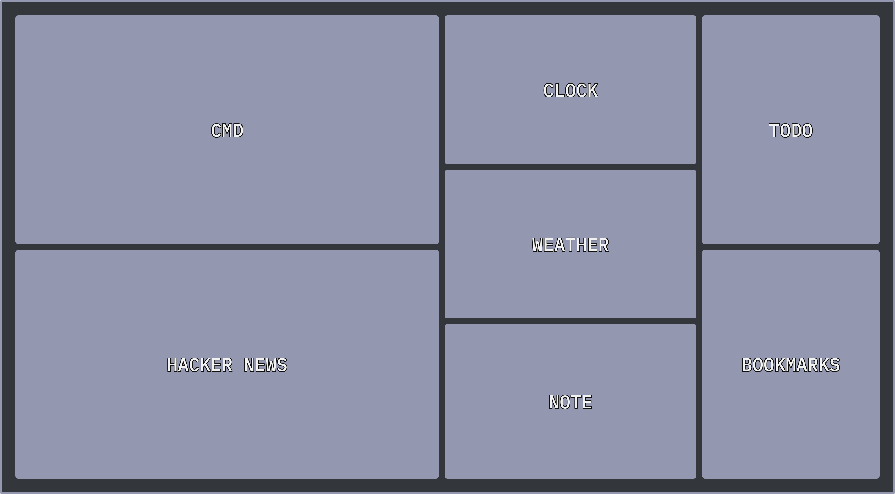

# TUI Dashboard

A minimal, command-driven personal dashboard inspired by the **TUI applications** aesthetic. Built with React 19, Vite, and Tailwind CSS v4, this dashboard combines a "terminal-first" interaction model with a clean, grid-based visual interface.

 _(Note: Placeholder for actual screenshot)_

## ✨ Features

- **Command-First Interface**: Control your entire dashboard through a central terminal.
- **TUI Aesthetic**: Monochrome design with `NDot55` and `Bebas` typography, minimal borders, and a signature dark purple accent.
- **Productivity Suite**:
  - **Pomodoro Timer**: Atomic timer with browser notifications for focus and break sessions.
  - **Todo List**: Task management with a custom-designed checkbox system.
  - **Quick Notes**: Save snippets of text instantly.
  - **Interactive Calendar**: Full-year and monthly views accessible via the `cal` command.
- **Live Data**:
  - **Weather & AQI**: Real-time weather data and Air Quality Index powered by Open-Meteo.
  - **Hacker News**: Live feed of the top 10 stories.
- **Intelligent Bookmarks**: Speed dial with an automated "Icon Engine" powered by Remix Icon.
- **Global Search**: Search Google or Perplexity directly from the prompt.

## ⌨️ Command Registry

Type `help` in the command prompt to see all available actions:

| Command               | Description                  | Example                    |
| :-------------------- | :--------------------------- | :------------------------- |
| `todo add <task>`     | Add a new task               | `todo add finish readme`   |
| `todo done <task>`    | Toggle task completion       | `todo done finish readme`  |
| `bm add <url> <name>` | Save a new bookmark          | `bm add github.com GitHub` |
| `note <text>`         | Save a quick note            | `note call mom at 5`       |
| `weather <city>`      | Set your dashboard location  | `weather London`           |
| `pomo start <f> <b>`  | Start Pomodoro (focus/break) | `pomo start 25 5`          |
| `cal [m/y]`           | Display calendar             | `cal may 2025`             |
| `g <query>`           | Search Google                | `g react 19 hooks`         |
| `clear`               | Wipe terminal history        | `clear`                    |

## 🛠️ Technical Architecture

- **State Management**: Centralized React Context (`DashboardContext.tsx`) managing all data models and UI transitions.
- **Persistence**: All user data (Todos, Notes, Bookmarks, Location) is persisted automatically via `localStorage` with safe JSON parsing.
- **Security**:
  - Sanitized URL inputs to prevent `javascript:` protocol XSS.
  - Protocol validation in the command engine.
- **Performance**:
  - Fetch requests are managed with `AbortController` to prevent memory leaks and race conditions.
  - Optimized 12-column CSS Grid layout for responsiveness.
- **Typography**: Custom `@font-face` integration for `NDot55`, `Bebas`, and `Poppins`.

## 🚀 Getting Started

### Prerequisites

- Bun/Node.js
- bun

### Installation

1. Clone the repository:

   ```bash
   git clone https://github.com/ishansing/homepage-shell.git
   cd dashboard
   ```

2. Install dependencies:

   ```bash
   bun install
   ```

3. Start the development server:

   ```bash
   bun run dev
   ```

### Building for Production

```bash
bun run build
```

## 📄 License

MIT
